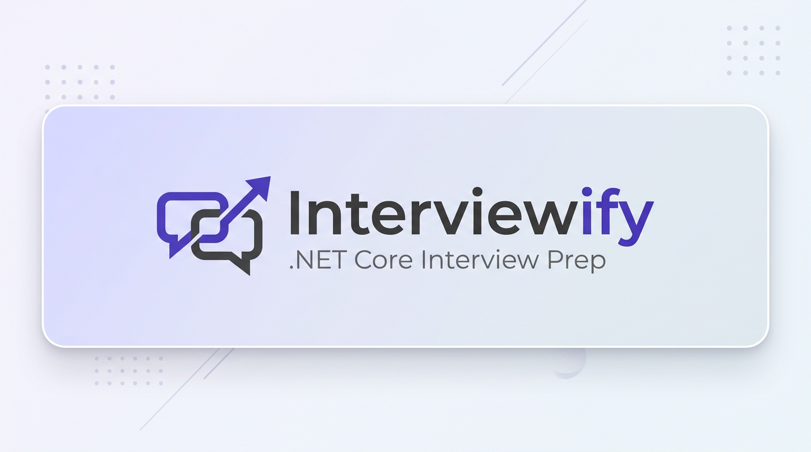

# Interviewify

<p align="center">
  
</p>

**Interviewify** is a full-stack interview preparation platform for .NET Core developers. It helps candidates master technical interviews and gives companies a structured way to browse categories, subcategories, and curated Q&A.

---

## About the Project

Interviewify combines a **.NET Core Web API** backend with a **Next.js** frontend to deliver:

- **Categories & subcategories** — Organize topics (e.g. C# Mastery, ASP.NET Core, Entity Framework Core).
- **Curated questions & answers** — Technical interview Q&A with model answers.
- **User accounts & dashboard** — JWT-based auth, profile, and admin-style management.
- **Responsive UI** — Modern dark theme with Tailwind CSS.

---

## Features

| Feature | Description |
|--------|-------------|
| **Categories** | Manage high-level topics (C#, ASP.NET Core, EF Core, etc.). |
| **Subcategories** | Fine-grained topics under each category. |
| **Questions** | CRUD for interview questions with title and answer. |
| **Auth** | Login, refresh token, logout; JWT Bearer. |
| **Account** | Profile, change password, optional profile picture. |
| **Dashboard** | Admin UI for categories, subcategories, questions, users, settings. |
| **Public pages** | Browse categories and questions without auth. |

---

## Tech Stack

| Layer | Stack |
|-------|--------|
| **Backend** | ASP.NET Core, Entity Framework Core, SQL Server, JWT |
| **Frontend** | Next.js 16, React 19, TypeScript, Redux Toolkit, Tailwind CSS |
| **Auth** | JWT access + refresh tokens, Bearer scheme |

---

## Project Structure

```
Interviewify/
├── API/                 # ASP.NET Core Web API (controllers, Program.cs)
├── Application/         # CQRS-style services, DTOs, validators, interfaces
├── Domain/               # Domain entities (User, Category, SubCategory, Question, etc.)
├── Infrastructure/      # EF Core DbContext, repositories, JWT service, file uploads
└── Client/              # Next.js app (pages, components, store, services)
```

---

## Screenshots & Walkthrough

### Home / Landing

The landing page lists categories and subcategories so users can start their .NET Core interview prep.


*Add a screenshot of the home page and save it as `Client/public/images/home-categories.png`.*

---

### Dashboard

Admins can manage categories, subcategories, questions, and users from the dashboard.


*Add a screenshot of the dashboard and save it as `Client/public/images/dashboard.png`.*

---

### Categories & Questions

Drill down from a category to subcategories, then view and practice questions with answers.


*Add a screenshot of category/subcategory/questions flow and save it as `Client/public/images/categories-questions.png`.*

---

## Getting Started

### Prerequisites

- .NET 8 SDK  
- Node.js 18+  
- SQL Server (or use existing connection string)

### Backend (API)

1. Open the solution and set **API** as the startup project.
2. Update `API/appsettings.json` (or `appsettings.Development.json`):
   - `ConnectionStrings:DefaultConnection` — your SQL Server connection.
   - `Jwt:Key` — a secure key (min 32 characters) for production.
3. Run migrations from the **Infrastructure** project (or API if it references it).
4. Run the API (e.g. F5 or `dotnet run` from the API folder).

### Frontend (Client)

```bash
cd Client
npm install
npm run dev
```

Open the URL shown (e.g. `http://localhost:3000`).

### Optional: Add your own screenshots

Place images in `Client/public/images/` and reference them in this README, for example:

- `Client/public/images/home-categories.png` — home page
- `Client/public/images/dashboard.png` — dashboard
- `Client/public/images/categories-questions.png` — categories/questions flow

---

## API Overview

| Area | Base path | Notes |
|------|-----------|--------|
| Categories | `api/categories` | List, get by id |
| Subcategories | `api/subcategories` | By category, by id |
| Questions | `api/questions` | By subcategory, by id |
| Auth | `api/auth` | login, refresh, logout |
| Users | `api/users` | CRUD, toggle status (admin) |
| Account | `api/account` | profile, change-password |
| Uploads | `api/uploads` | e.g. profile pictures |

Use **Bearer {token}** in the `Authorization` header for protected endpoints.
